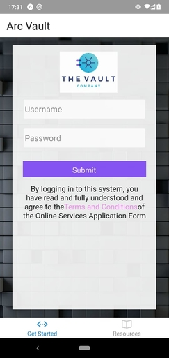
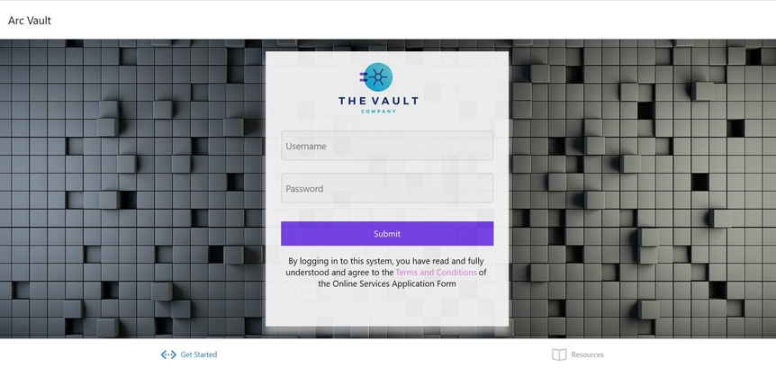

# React-native-login
Login page for IOS and Android

## To start the project
### Frontend
Go to login folder.
Type on cmd - "npm start" (node should be installed).
A dashboard will be opened on browser.
Click on "Run on web browser" for web app.
For Android or IOS "Run on android" or "Run on IOS" respectively.

