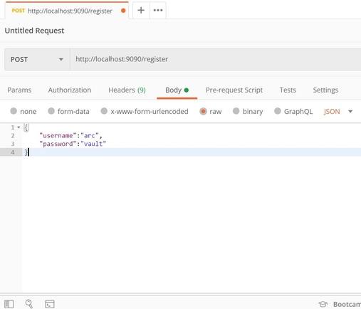
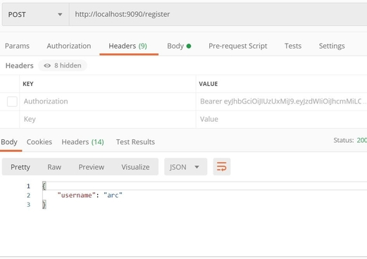
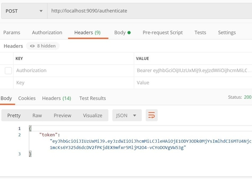
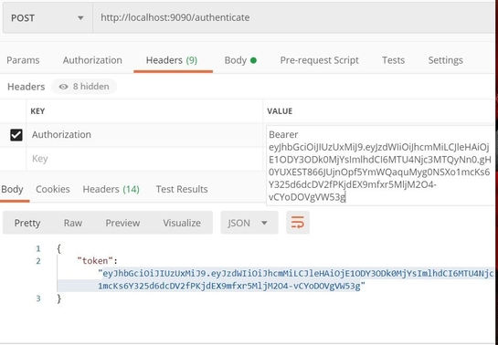
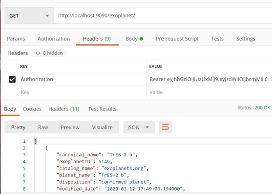

# How to start application

JWT secures the application and uses authentication 

## Run the application as spring boot app

### Step 1: Register the username and password as a POST request as shown in Postman

### Step 2: Keep the username and password same, use "/authenticate" to generate unique hashcode

### Step 3: Add header as "Authorization" and add hashcode generated in above step prefixing with " Bearer [space] hashcode"

### Step 4: GET request using above header and different URl

